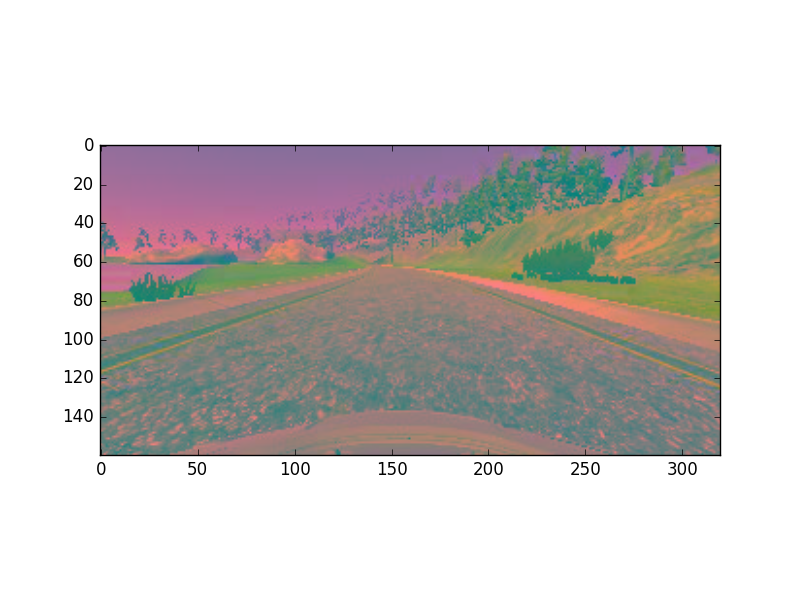
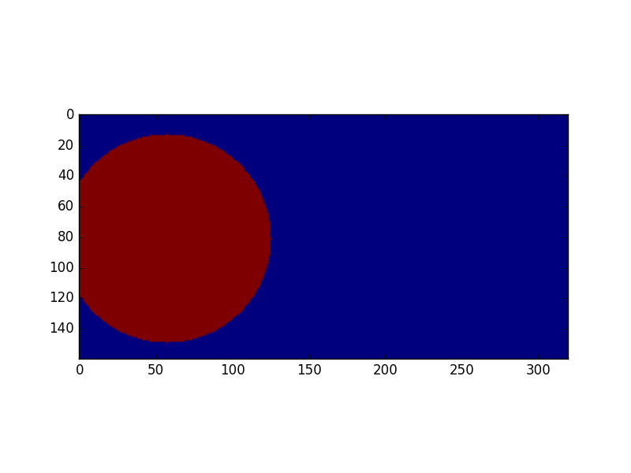
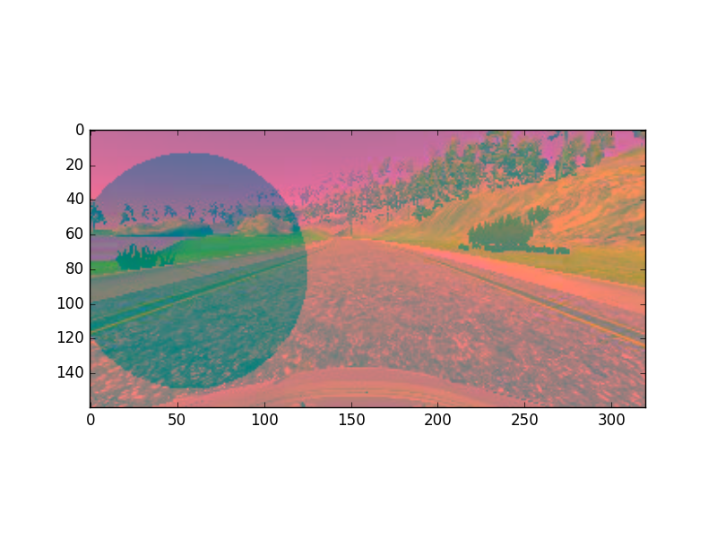
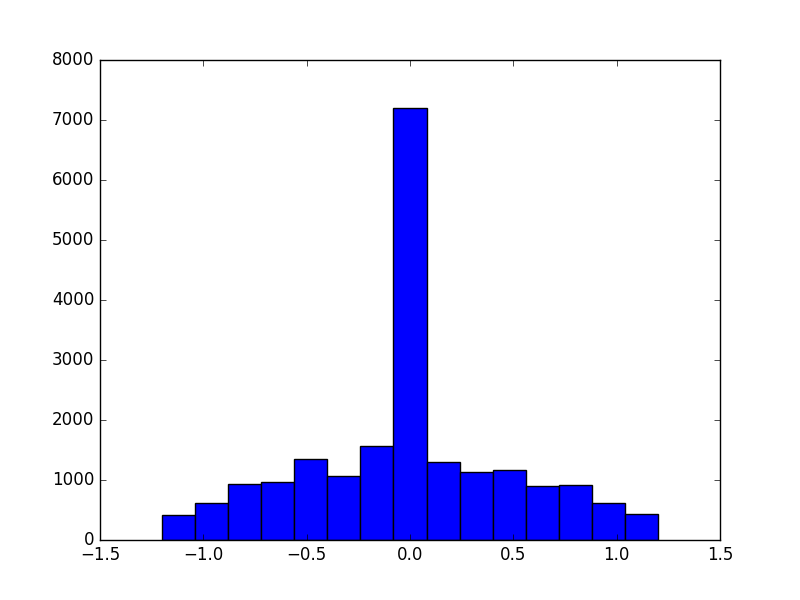
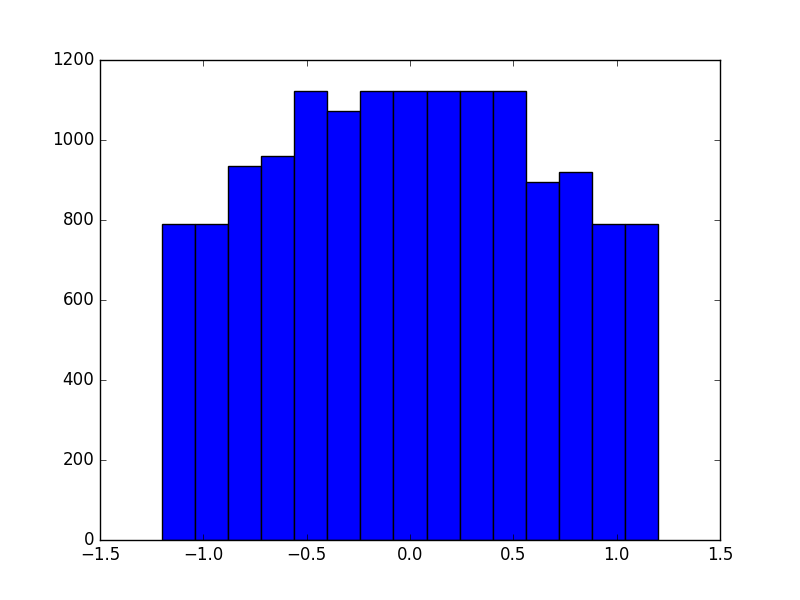

# **Behavioral Cloning** 

## Writeup by Maxime Lemonnier

### Files Submitted & Code Quality

#### 1. Required Files

My project includes the following files:

* model.py allows to create the model, prepare the dataset for training, and train the model.
* drive.py modified to convert images to YUV color space and fitted with a full PID
* model.h5 containing a trained convolution neural network inspired from this [paper](https://images.nvidia.com/content/tegra/automotive/images/2016/solutions/pdf/end-to-end-dl-using-px.pdf).
* video.mp4 presenting a successful run on the first track.
* writeup_report.md: this file

#### 2. Quality of Code
Using the Udacity provided simulator and my drive.py file, the car can be driven autonomously around the track by executing 
```sh
python drive.py model.h5
```
Note that the simulator has only been tested at 640x480, with fastest quality settings. It has been found crucial that for the second track the framerate is sufficient for the pid controller no to lag. Anyhow, the vehicle speed would sometimes stall at zero on the center of the road, with no obstacle in front, with the controller commanding raising throttle with no effect. It happend often on track 2.


#### 3. Submission code is usable and readable

All the relevant code is part of model.py. The file is divided in 2 sections:

* The first section contains a data distribution analysis as well as some data reorganisation necessary for the training phase.
* The second section contains code to split the organised data into a train and validation datasets. No test dataset was considered necessary. A model creation function and a data generator function are defined and then used. Finally, the model is compiled, trained saved, and its learning curve is anaylsed.   

### Model Architecture and Training Strategy

#### 1. An appropriate model architecture has been employed

Various models were tried. Starting with a LeNet variation ending with a trimmed-down version of the [nvidia model](https://images.nvidia.com/content/tegra/automotive/images/2016/solutions/pdf/end-to-end-dl-using-px.pdf].

#### 2. Attempts to reduce overfitting in the model

Various method were experimented to reduce overfitting, including adding dropout layers, using weights L2-normalization, using max pooling layers, as well as adding more data, and reducing the number of weights. None of theese effort seemed, at first, to have a significant impact: the car would, at best, fail a little bit after the bridge. In the end only weights normalisation was kept (model.py, function ```nvidia_model()```). 

#### 3. Model parameter tuning

The model used an adam optimizer. No learning rate tuning seemed necessary.

#### 4. Appropriate training data

The final dataset was generated using the mouse to reduce measurement alias, and comprized more than 3 laps in each direction and one lap of recovery driving in each direction. For regions where the dataset was scarse (generally, for sharper steering angles), all 3 images were only used and other data augmentation tecnhiques were used, namely, image flipping as proposed in the classroom, random global brightness transformation, ramdom circle shadows (shown below, see function random_morph() in model.py). 




### Model Architecture and Training Strategy

#### 1. Solution Design Approach

I iterated on various architectures and variations, always consisting of a convolution pipeline, followed with a dense pipeline. The car would always fail at some point on the track and, no matter how much data I added, no matter what regularization technique I used (dropout, l2-normalisation, add more data), no matter how long/fast I trained, reducing the validation error was not translating into improved performance on the track. Then, I did what one should always do first : I looked at the dataset distribution. I noticed two things:

* Some of my acquisitions contained *only* 0 angles. I realized I forgot to start the simulator from the command line, and thus ```export LANG=en_US.utf8``` was not performed and angles values were ignored. I estimate failing to realize this sent me in the wrong track for a good 10 hours.
* The rest of the acquisitions were *heavily* concentrated around 0, as shown below.



So I went on the path of flatteing my data distribution, with the self-imposed constraint of throwing away as little data as possible. More on that topic in section 3. With the proper dataset, my simplified nVidia-inspired model succeeded right away, with only 2 epochs of training. The car was wobbling a lot, I suspected it was because my dataset was now unaturally concentrated on sharp-angles values. Then I tried the second track, and, after lowering the set speed to 5 mph, the car would stay on track, but sometime stall in a slope. I tried adding a derivative factor to the PI controller, but then I realized that, with the quality settings at "fantastic", my laptop GPU was underpowered, and the lag between frames would destabilize the throttle controller. So I tried with "fastest" and, to my great surprized I completed a lap at 9 mph on the second track, even tough I had very little training data (~10%) on this track. 


#### 2. Final Model Architecture

The final model architecture (function ```nvidia_model()``` in model.py) consisted of a convolution neural network with the following details:

Layer (type) | Output Shape |Param # | other notes                     
:---------:|:---------:|:---------:|:---------:
cropping2d_1 (Cropping2D)        |(None, 65, 320, 3)   | 0         |  input_shape=(160,320,3)         
lambda_1 (Lambda)                |(None, 65, 320, 3)   | 0         |           
convolution2d_1 (Convolution2D)  |(None, 31, 158, 16)  | 1216      |  relu activation, (16,5,5) kernel, (2,2) stride, valid borders, l2 normalisation       
convolution2d_2 (Convolution2D)  |(None, 14, 77, 32)   | 12832     |  relu activation, (32,5,5) kernel, (2,2) stride, valid borders, l2 normalisation      
convolution2d_3 (Convolution2D)  |(None, 12, 75, 64)   | 18496     |  relu activation, (64,3,3) kernel, (1,1) stride, valid borders, l2 normalisation       
flatten_1 (Flatten)              |(None, 57600)        | 0         |           
dense_1 (Dense)                  |(None, 100)          | 5760100   |  relu activation, l2 normalisation        
dense_2 (Dense)                  |(None, 50)           | 5050      |  relu activation, l2 normalisation        
dense_3 (Dense)                  |(None, 25)           | 1275      |  relu activation, l2 normalisation        
dense_4 (Dense)                  |(None, 10)           | 260       |  relu activation, l2 normalisation        
dense_5 (Dense)                  |(None, 1)            | 11        |  tanh activation, l2 normalisation        
----------------------------------------------------------------------------------------------------
Total params: 5,799,240
____________________________________________________________________________________________________

It can be seen as a simplified version of the nVidia model we talked earlier. In retrospect, I think that the defining factor had more to do with presenting the right dataset to the learning algorithm, than choosing the right model. That said, a model that would have used a rolling sequence of images or a recursive model such as an RNN or an LSTM could have worked much better. Yet, the optimal AI tool for the job would have been deep reinforcement learning, provided some alteration to the simulation engine, such as knowing when the car is on the road, and when its not.

This model still has 5.8M parameters so we must be careful for overfitting. Which is why we added *l2*-normalisation to each parametric layer.

#### 3. Creation of the Training Set & Training Process

Final dataset was generated using the mouse, driving more than 3 laps in each direction on the first track, then doing some recovery captures. 2 more laps were added from the second track. Knowing there was a small-angle bias on the dataset, I only added left and right images for angles > 0.15, correcting central steering angle by +/- .2, as advised by udacity. I then computed steering angles mean and standard variation, which I used to clip original dataset's histogram to create a *target* histogram, I did not remove any sample yet, only drew up a desired histogram. See model.py line 70 for more details. I obtained the following histogram:


This histogram would then be used by the dataset generator function to draw samples and augment dataset accordingly. Note that *all* dataset was still available to the generator function, which would, for each slice of the dataset (let's call it the *candidate batch*), shuffle the *candidate batch*, and then add samples in each of the target histogram's bin, potentially using one (image flipping) or two (image alteration) data augmentation techniques, until each bin was full and/or ```batch_size``` was reached. So it had for result that, for each augmented sample, a sample in the *candidate batch* would remain unused. Statistically, unused samples would belong small angles bins. The end result is a bit of an abuse of the *epoch* concept, since batch *n* of epoch *m* would almost certainly be different from batch *n* of any other epoch, especially for samples in crowded bins.

The model trained during 10 epochs, using 14464 original samples, and obtained the following history:


We can see that error would continue going down if we added more epochs. Using the resulting model allowed the car to run as many laps as wanted on both tracks without problems, other than a rather woobly behavior, especially on track one.

I could have improved the smoothness of the drive by tweaking my target distribution but I lost so much time on the ',' vs '.' issue that I'm out of budget. ```video.mp4``` shows a successful lap on track 1, and part of a lap on track 2 (track 2 is much longer).  


